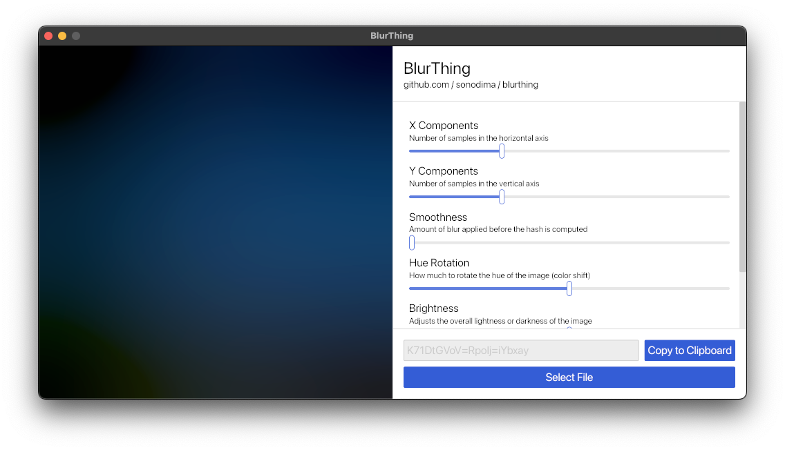

# BlurThing

Stupid simple application for generating and customizing [BlurHashes](https://blurha.sh) from images, with extensive controls for image manipulation.



## Requirements

- [rust & cargo](https://rustup.rs) for building the project
- [cargo-bundle](https://crates.io/crates/cargo-bundle) for packaging the application

## Build and Package

You can compile and package the project with:

```sh
cargo bundle --release
```

<br/>

---

<br/>

**NOTE:** This project was quickly hacked together and may have some rough edges. Feel free to open an issue or PR if you find any problems.

**NOTE2:** Multi-threading when? 🤔
