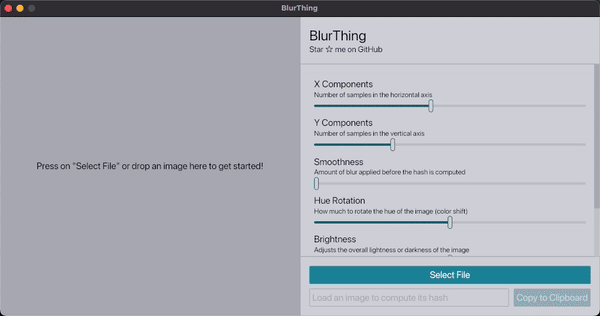

<div align="center" style="margin-top: 24px;">
    
    <div style="margin-top: 24px; margin-bottom: 24;">
        <h1>BlurThing 🌄</h1>
        <span>Simple application for generating and customizing <a href="https://blurha.s">
            BlurHashes</a> from<br/>images, with extensive controls for
            image manipulation.</span>
    </div>
</div>

## Usage

1. Open an image file with the open file dialog
2. Adjust the image manipulation parameters to your liking
3. Copy the blur hash to the clipboard

## Hotkeys

Some hotkeys are available for faster interaction:

- <kbd>Ctrl</kbd> + <kbd>O</kbd> -> shows the open file dialog
- <kbd>Ctrl</kbd> + <kbd>C</kbd> -> copies the BlurHash to the clipboard
- <kbd>Ctrl</kbd> + <kbd>Z</kbd> -> undo the last modification
- <kbd>Ctrl</kbd> + <kbd>Shift</kbd> + <kbd>Z</kbd> -> redo the last modification

## Build and Run

### Requirements

- [rust & cargo](https://rustup.rs) for building the project
- [cargo-bundle](https://crates.io/crates/cargo-bundle) for packaging the application

### Debugging

To run the project in debug mode, use:

```sh
cargo run
```

**NOTE:** some dependencies will still be compiled in release mode for performance reasons.

### Packaging

You can compile and package the project with:

```sh
cargo bundle --release
```

_Now sit back and relax: we have all the optimizations enabled, so it will take a
while to compile._ 🥹
